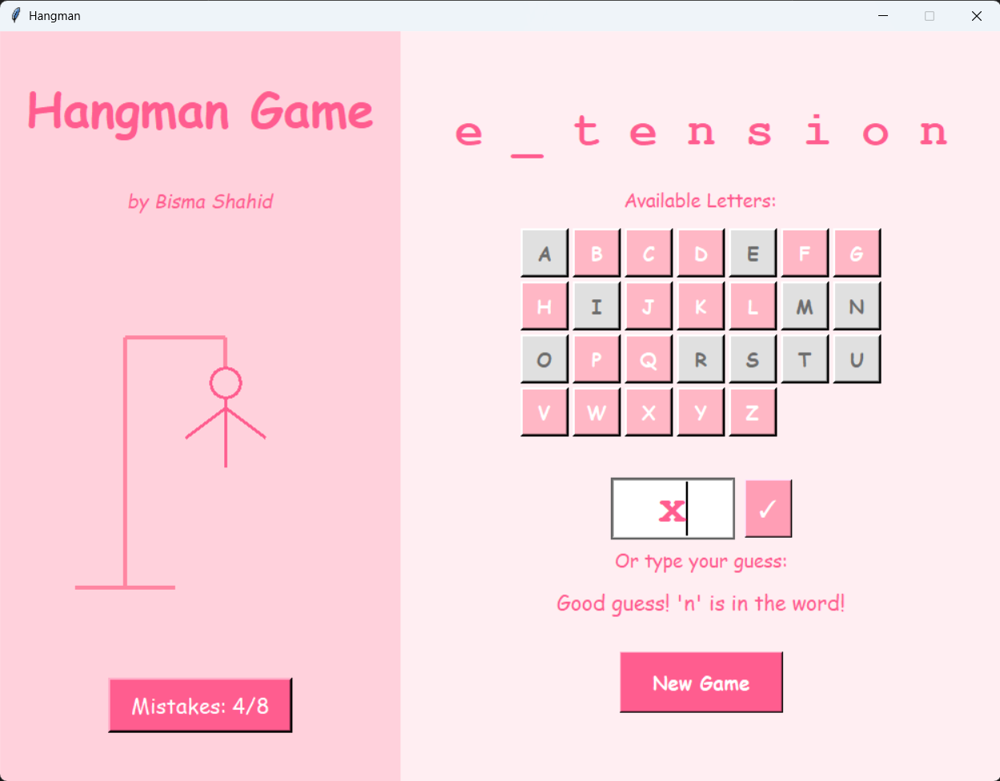

# Hangman Game (Tkinter GUI)

A **Python-based Hangman game** with a **beautiful Tkinter GUI**, interactive letter buttons, dynamic hangman drawing, and a restartable game loop. Players guess letters to reveal a hidden word while avoiding too many wrong guesses!

---

## Preview  
  

---

## Overview

This desktop game recreates the classic **Hangman word guessing challenge** with an engaging interface. It features **custom fonts, colors, and smooth UX**, making it more appealing than a console version.  

The secret word is randomly chosen from a dictionary file (`dictionary.txt`) or a built-in fallback list.

---

## Key Features

✅ **Graphical User Interface**
- Left panel for **title & hangman drawing**  
- Right panel for **letter buttons, word display & status**  

✅ **Dynamic Gameplay**
- Guess letters using **buttons or keyboard input**  
- **Real-time updates** to guessed word & available letters  
- **Step-by-step hangman drawing** for mistakes  

✅ **Win/Lose Popup Messages**
- Win → "You guessed the word!"  
- Lose → "Game Over! Shows the correct word"  

✅ **Custom Styling**
- Pastel color palette & Comic Sans fonts  
- Buttons change state after guessing  
- Centered main window & popup dialogs  

✅ **Restart Anytime**
- Click **New Game** to start a fresh round  

---
## Controls

- Click on letters or type a letter in the input box
- If the letter exists → It’s revealed in the word
- If it doesn’t → A new hangman part is drawn
- Win → Guess all letters before max mistakes
- Lose → Exceed 8 mistakes

---
## 🛠️ How to Run

## Requirements  

- Python **3.8+**  
- Tkinter (comes pre-installed with Python)
  
## Future Improvements  

- Add a difficulty level selector (Easy, Medium, Hard)
- Support multi-word phrases
- Save & track high scores
- Theme customization (Dark Mode / Light Mode)
- Improved animations for the hangman drawing

## License  

This project is for **academic and educational use**. Please give credit if reused or modified.  

## Developed By  

**BISMA SHAHID**  
Department of Software Engineering  
FAST NUCES KHI  
